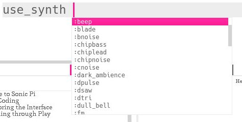

# Workshop Sonic Pi

Write programs to compose music.

# Examples

There are many examples that come bundled with Sonic Pi. They can be found in the help section or by loading them in a buffer, start typing:

```ruby
load_example 
```
And an autocomplete list shows up.


Pick one and hit `enter`, then you need to execute that statement by hitting the run button or use the shortcut `alt+r`.

> It's important to learn these shortcuts, it's possible to live code complex music without ever lifting your fingers from the keyboard.

To hear the example hit `alt-r` again.

> Sonic pi uses the *alt* key for shortcuts, including copying and pasting. So to copy from the manual use `alt-c` `alt-v` and `alt-a` to select everything 

# Have a look around

Experiment a bit with the example code and hear the music change.

We don't have much time so let's take a step back and start with the basics.

# First Beeps

The simplest thing you can do in Sonic Pi is

```ruby
play 60
```

This plays MIDI note 60 which is the 4th c on the piano keyboard. You can also use note names.

```ruby
play :c4
```

These show up in the log where you can have a look at all sorts of messages scrolling by, this can come in handy if your code is not doing what you expect.

```ruby
play 60
play :c4
```


## Everything plays at the same time

Lets play a chord:

```ruby
play :c4
play :eb4
play :g4
```

This is equivalent to 

```ruby
play 60
play 63
play 67
```
## Sleep

The next import command is `sleep`, it tells Sonic Pi to wait before continuing the program.

```ruby
play :c4
sleep 1
play :eb4
sleep 0.5
play :g4
```

## Tempo
Sonic Pi defaults to 60 bpm, which is handy for mental math. This can be overwritten by setting it.

```ruby
use_bpm 120
```

## Congratulations!
Really, that's all you need to make basically all western music. Let's have a look at things to make it easier and sound better.

# Synths

Sonic Pi uses Supercollider in the background for generating sound and it has provided some synths for us to use.

`use_synth` will pop up a list of available synthesizers. If you're in for a challenge you can write your own synth in Supercollider and use it in Sonic Pi.



You can output things to the log with `puts` and there happens to be a variable that holds all synth names.

```ruby
puts synth_names
```

> (ring :beep, :blade, :bnoise, :chipbass, :chiplead, :chipnoise, :cnoise, :dark_ambience, :dpulse, :dsaw, :dtri, :dull_bell, :fm, :gnoise, :growl, :hollow, :hoover, :mod_beep, :mod_dsaw, :mod_fm, :mod_pulse, :mod_saw, :mod_sine, :mod_tri, :noise, :piano, :pluck, :pnoise, :pretty_bell, :prophet, :pulse, :saw, :sine, :sound_in, :sound_in_stereo, :square, :subpulse, :supersaw, :tb303, :tech_saws, :tri, :zawa)

Don't worry about the "ring" in front, we'll get to that later.

```ruby
use_synth :chiplead
play 60
use_synth :subpulse
play 46
```

# Samples
For more sounds we can use samples. There are quite a lot build into Sonic Pi but you can use your own