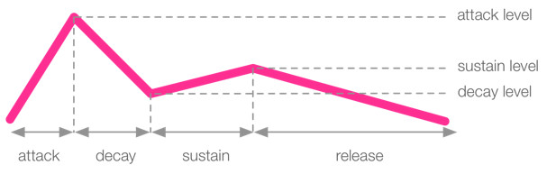

# Workshop Sonic Pi

Write programs to compose music.

# Examples

There are many examples that come bundled with Sonic Pi. They can be found in the help section or by loading them in a buffer, start typing:

```ruby
load_example 
```
And an autocomplete list shows up.


Pick one and hit `enter`, then you need to execute that statement by hitting the run button or use the shortcut `alt+r`.

> It's important to learn these shortcuts, it's possible to live code complex music without ever lifting your fingers from the keyboard.

To hear the example hit `alt-r` again.

> Sonic pi uses the *alt* key for shortcuts, including copying and pasting. So to copy from the manual use `alt-c` `alt-v` and `alt-a` to select everything 

# Have a look around

Experiment a bit with the example code and hear the music change.

We don't have much time so let's take a step back and start with the basics.

# Help
Sonic Pi has a really great help section build in. It explains (almost) everything you can do with Sonic Pi and by just going through it will take you through all the basics of programming you'll need.


Finding *Sam Aaron* on YouTube will get you a lot of extra information and the reasons why Sonic Pi is what it is and how it works behind the screens.

# First Beeps

The simplest thing you can do in Sonic Pi is

```ruby
play 60
```

This plays MIDI note 60 which is the 4th c on the piano keyboard. You can also use note names.

```ruby
play :c4
```

These show up in the log where you can have a look at all sorts of messages scrolling by, this can come in handy if your code is not doing what you expect.

```ruby
play 60
play :c4
```


## Everything plays at the same time

Lets play a chord:

```ruby
play :c4
play :eb4
play :g4
```

This is equivalent to 

```ruby
play 60
play 63
play 67
```

or even shorter:
```ruby
play [60, 63, 67]
```
## Sleep

The next import command is `sleep`, it tells Sonic Pi to wait before continuing the program.

```ruby
play :c4
sleep 1
play :eb4
sleep 0.5
play :g4
```

## Tempo
Sonic Pi defaults to 60 bpm, which is handy for mental math. This can be overwritten by setting it.

```ruby
use_bpm 120
```

## Congratulations!
Really, that's all you need to make basically all western music. Let's have a look at things to make it easier and sound better.

# Synths

Sonic Pi uses Supercollider in the background for generating sound and it has provided some synths for us to use.

`use_synth` will pop up a list of available synthesizers. If you're in for a challenge you can write your own synth in Supercollider and use it in Sonic Pi.


You can output things to the log with `puts` and there happens to be a variable that holds all synth names.

```ruby
puts synth_names
```

> (ring :beep, :blade, :bnoise, :chipbass, :chiplead, :chipnoise, :cnoise, :dark_ambience, :dpulse, :dsaw, :dtri, :dull_bell, :fm, :gnoise, :growl, :hollow, :hoover, :mod_beep, :mod_dsaw, :mod_fm, :mod_pulse, :mod_saw, :mod_sine, :mod_tri, :noise, :piano, :pluck, :pnoise, :pretty_bell, :prophet, :pulse, :saw, :sine, :sound_in, :sound_in_stereo, :square, :subpulse, :supersaw, :tb303, :tech_saws, :tri, :zawa)

Don't worry about the "ring" in front, we'll get to that later.

```ruby
use_synth :chiplead
play 60
use_synth :subpulse
play 46
```

# Samples
For more sounds we can use samples. There are quite a lot build into Sonic Pi but you can use your own too. Let's start with the build in ones. Use the command `sample` and a list will pop up. Pick one and `alt+r` to play it.

```ruby
sample :ambi_piano
```

Using your own sample:
```ruby
sample "/home/roel/Music/samples/Loops/DRUMS/drum_92BPM_01.wav"
```
Using sample packs it's best to put the folder in a variable and select a sample from there.

```ruby
drums = "/home/roel/Music/samples/Loops/DRUMS/"
sample drums, 2
```

Usually sample packs have file names indicating their bpm or key:


So let's say our music is in 110 BPM, we can filter out those in Sonic Pi:

```ruby
drums = "/home/roel/Music/samples/Loops/DRUMS/"
sample drums, "120", 5
```

# Envelopes
Like a lot of synths Sonic Pi uses envelopes to shape the sound.

Have a look at the Sonic Pi manual section 2.4 for all the details as some of them are a bit specific to Sonic Pi.



Use it like this:
```ruby
play 60, attack: 0.1, attack_level: 1, decay: 0.2, decay_level: 0.3, sustain: 1, sustain_level: 0.4, release: 0.5
```
Of course you can leave out the ones you don't care about.

Envelopes work on samples too:
```ruby
sample :ambi_dark_woosh, attack: 2, decay: 0, sustain: 0, decay: 2
```

# More parameters
Sonic Pi provides an almost infinite amount of parameters to change your sound. Some of the most usefull are:

 - `amp:` for amplification, defaults to 1 but you can go from 0 to wherever
 - `pan:` 1 is full right, -1 is full left, 0 is the exact middle

For samples there are a lot but make sure to try out these ones:

- `lpf:` low pass filter
- `hpf:` high pass filter
- `rate:` 1 is normal speed, -1 is backwards, 2 is twice the speed
- `beat_stretch:` stretches the sample to fit a number of beats

# Effects
Sonic Pi is loaded with effects. Take a look at the *Fx* tab in the help section. You use them by containing your code in a `with_fx` block.

For the old skool 8-bit game effect use `:bitcrusher`

```ruby
use_bpm 200
with_fx :bitcrusher do
  play [:d3, :fs4, :e5]
  sleep 0.5
  play [:d3, :fs4, :e5]
  sleep 1
  play [:d3, :fs4, :e5]
  sleep 1
  play [:d3, :fs4, :c5]
  sleep 0.5
  play [:d3, :fs4, :e5]
  sleep 1
  play [:g4, :b4, :g5]
  sleep 2
  play [:g3, :g4]
end
```

Use a bit of `:distortion` to simulate a crappy speaker. Effects can take parameters, look them up in the help section.

There is much more to discover but first let's move on to something else.

# Loops
Programmers are lazy, and copy pasting code a few times is just too much work. Use loops.

Take this masterpiece for example:

```ruby
use_bpm 120
sample :loop_amen, beat_stretch: 4
use_synth :chipbass
play 40
sleep 1
play 40
sleep 1
play 40
sleep 1
play 40
```

## Infinite loops

Wouldn't it be awesome if it went on forever? Copy pasting is hard work, especially since Sonic Pi makes you use the `Alt` key in stead of `Ctrl` like a normal person. 

```ruby
use_bpm 120
use_synth :chipbass
loop do
  sample :loop_amen, beat_stretch: 4
  play 40
  sleep 1
  play 40
  sleep 1
  play 40
  sleep 1
  play 40
  sleep 1
end
```
We can do even better, and make the beat a bit more interesting.

```ruby
use_bpm 120
use_synth :chipbass
loop do
  sample :loop_amen, beat_stretch: 4
  3.times do
    play 40
    sleep 1
  end
  play 41
  sleep 0.5
  play 40
  sleep 0.5
end
```

Loops have iterators, you don't need to type them by default but if you add them you can use them for more interesting effects.

```ruby
use_bpm 120
use_synth :chipbass
loop do
  sample :loop_amen, beat_stretch: 4
  3.times do |i| #i is the iterator and will count up from 0
    play 40 + i
    sleep 1
  end
  play 41
  sleep 0.5
  play 40
  sleep 0.5
end
```

# Something Random in between
Use some randomness in your music to make it sound more interesting. `rrand` stands for *ranged random*, give it a range as parameter.

```ruby
loop do
  play rrand(50, 80)
  sleep 0.25
end
```
If you only want integer values use `rrand_i`. 

Because Sonic Pi wants your compositions to sound the same on any machine that executes your code *random* is not really random. Do a `play rrand(50,80)` and look at the log output.

>{run: 104, time: 0.0}
>
> └─ synth :beep, {note: 72.5018}

Look at your log, at your friend's log, it will be the same value.

To vary the values you get you must *seed* the number generator with a value:

```ruby
use_random_seed 123
loop do
  play rrand(50, 80)
  sleep 0.25
end
```

Random numbers are not only for note values, they are for parameter values too.

# Variables
Sometimes you want to reuse a certain value. You can copy paste it everywhere but that's not just the programmer way. Waht if the value is random? Stick in a variable!

```ruby
myValue = rrand(0,1)
```

Now you can do things like this: (Note: don't do this.)
```ruby
loop do
  duration = rrand(0.5,1.5)
  sample :loop_amen, beat_stretch: duration
  sleep duration
end

```

## Rings
Now we are talking variables let's see how we can group them together. We already saw an example with `play [60,64,72]` but there is more to learn.

Rings are handy for music as it goes in cycles, which is used all the time in music. We saw how to use loops but take a look at this example:

Create a ring with the ring keyword inside brackets: 
```ruby
(ring 60, 64, 67, 72, 58)
```
play all notes in the ring simultaneously: 
```ruby
play (ring 60, 64, 67, 72, 58)
```
You can step trough a ring, it goes on forever. Play the first element:
```ruby
play (ring 60, 64, 67, 72, 58)[0] #plays 60
```
There are 5 elements in this ring, the last one has index 4:
```ruby
play (ring 60, 64, 67, 72, 58)[4] #plays 58
```
But since a ring keeps going the next index is equal to the first again:
```ruby
play (ring 60, 64, 67, 72, 58)[5] #plays 60
```
### Tick
Keep the ring going with `.tick`.
```ruby
loop do
  play (ring 60, 64, 67, 72, 58).tick
  sleep 0.25
end
```
The ring remembers where you were, every time `tick` is called it goes to the next element.

### Choose
`.choose` will pick a random element from the ring.
```ruby
loop do
  play (ring 60, 64, 67, 72, 58).choose
  sleep 0.25
end
```

## Lists
Similar to rings are lists. They don't loop over but they come in handy in other situations:
```ruby
loop do
  play (ring 60, 64, 67, 72, 58).tick, amp: [0.5, 1].choose
  sleep 0.25
end
```
Note that you don't use `pick` but `choose` to get a random element from a list.

# More Loops
## Multiple loops at the same time
If you write code in a loop without specifying the number of iterations you want, it will play forever, never getting to whatever you have coded below. 

```ruby
use_bpm 120

loop do
  sample :loop_amen, beat_stretch: 4
  sleep 4 #sleep needed or the sample will play infinite times at once
end

#This code will never execute
use_synth :chipbass
loop do
  3.times do |i| #i is the iterator and will count up from 0
    play 40 + i
    sleep 1
  end
  play 41
  sleep 0.5
  play 40
  sleep 0.5
end
```
For running multiple things at the same time we need threads. Everybody will tell you threads are hard but Sonic Pi makes it easy.