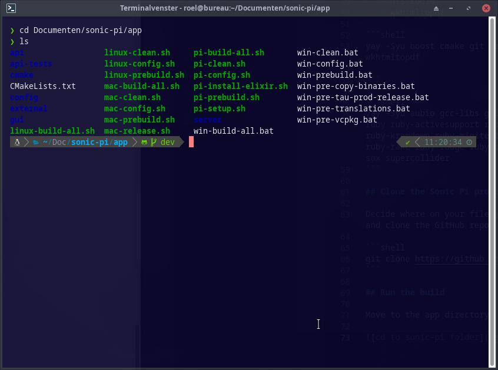

# Compile Sonic Pi from source

To get the latest and greatest you need to compile Sonic Pi yourself. The versions packaged by most distros are out of date and lack some fun features. The version from the [Arch User Repository](https://aur.archlinux.org/packages/sonic-pi-git) lacks OSC and MIDI support.

Here I'll talk you through compiling Sonic Pi yourself based on the instructions on the [Sonic Pi GitHub repository](https://github.com/sonic-pi-net/sonic-pi).

## Dependencies

From the Linux installation instructions:
 - Build Tools (c++ compiler, cmake, git.)
 - Qt + Dev tools (5.15+)
 - Jack (and pulse-audio-module-jack if you are running Raspberry Pi OS)
 - Ruby + Dev tools (2.5+)
 - Elixir + Dev tools (12.0+)
 - SuperCollider + SC3 plugins

From the AUR package build:

 - depends
    + aubio
    + gcc-libs
    + glibc
    + osmid
    + qt6-base
    + qscintilla-qt6
    + ruby
    + ruby-activesupport
    + ruby-bundler
    + ruby-ffi
    + ruby-i18n
    + ruby-kramdown
    + ruby-minitest
    + ruby-mocha
    + ruby-multi_json
    + ruby-rake
    + ruby-rouge
    + ruby-rugged
    + ruby-sys-proctable
    + sc3-plugins
    + sox
    + supercollider
 - makedepends
   + boost
   + cmake
   + git
   + erlang-nox
   + gendesk
   + lua
   + qt6-tools
   + wkhtmltopdf

 - packages missing from dependencies above
   + rtmidi 
   + elixir
   + base-devel (maybe not needed)
   + jack-example-tools

```shell
yay -Syu boost cmake git erlang-nox gendesk lua qt6-tools wkhtmltopdf base-devel

```

```shell
yay -Syu aubio gcc-libs glibc osmid qt6-base qscintilla-qt6 ruby ruby-activesupport ruby-bundler ruby-ffi ruby-i18n ruby-kramdown ruby-minitest ruby-mocha ruby-multi_json ruby-rake ruby-rouge ruby-rugged ruby-sys-proctable sc3-plugins sox supercollider rtmidi elixir jack-example-tools
```

## Clone the Sonic Pi project

Decide where on your filesystem you want the Sonic Pi project and clone the GitHub repo:

```shell
git clone https://github.com/sonic-pi-net/sonic-pi.git sonic-pi
```

## Small changes

Today, 20220213, some small changes are needed to be able to compile Sonic Pi.

In `linux-build-all.sh` add `-n` to the call to linux-prebuild.sh so it looks like this:

```shell
"${SCRIPT_DIR}"/linux-prebuild.sh -n

```

In `linux-config.sh` add `no_imgui=true` after the `getopts` loop:

```shell
while getopts ":n" opt; do
  case $opt in
    n)
      no_imgui=true
      echo "Running config script without support for IMGUI-based GUI"
      ;;
    \?)
      echo "Invalid option: -$OPTARG" >&2
      exit 1
      ;;
  esac
done

no_imgui=true

config=""

```

## Run the build

Move to the app directory.



Build all:

```shell
./linux-build-all.sh
```
