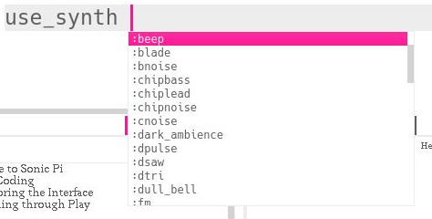
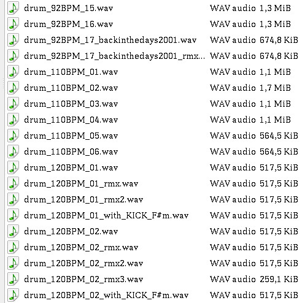
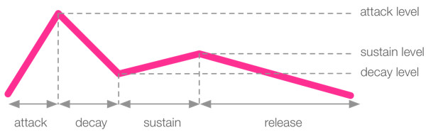
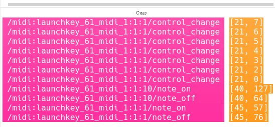

# intro

## about me

> slide 01_about_me

 - started in 2006
 - mostly SQL and PL/SQL
 - now experienced Java developer
 - also Python, Kotlin, Android, JavasCript, ...
 - no social media except for LinkedIn
 - please send me photos I can share

## about Continuum

> slide 02_about_continuum

- Mostly Java but also Frontend with JavaScript frameworks, AI, ...
- Great place to work!

## about Coderdojo

> slide 03_about_coderdojo  **!!!TODO !!!**

- Volunteers
- Kids from 7 years and up
- Scratch and Python
- or everything they ask

# Share code with me

> slide 04_share_code

https://codeshare.io/wnYONJ

You don't need to make an account!

# About Sonic Pi

> show Sonic Pi

With Sonic Pi you can make using by writing code. It's simple enough so everybody at any level can start using it but it's also powerfull enough to create complex compositions and to play it live.

- The language used is **Ruby** like. It does not have all features of Ruby but if you are wondering how to code something then search for `ruby something`

- If you save your creations use extension `.rb` so other editors and IDE's like VS Code format it as Ruby code.

## annoying use of Alt in stead off Ctrl

For some reason Sonic Pi uses alt for everything, copy and paste, running the code .... so keep that in mind.

Or do something about it:

>  - go to [github.com/sonic-pi-net/sonic-pi](github.com/sonic-pi-net/sonic-pi)
> - clone the project so you have it on your computer
> - go to `sonic-pi/app/gui/qt/` 
> - open `mainwindow.cpp`
> - search for `alt`
> - at line 2483 the code starts
> - chanche every `alt` to `ctrl` and refactor the code
> - compile Sonic Pi yourself

## Where to get help

1. The Sonic Pi *Help* is the best place to start.
2. Youtube, search for Sam Aaron
3. MagPi magazine [article](https://magpi.raspberrypi.com/articles/sonic-pi-techniques)

## save and load code

- use `.rb` as extension so other editors can format it as Ruby code

# Examples

There are many examples that come bundled with Sonic Pi. They can be found in the help section or by loading them in a buffer, start typing:

```ruby
load_example 
```
And an autocomplete list shows up.

Hit the *run button* or use the shortcut *alt+r*.

# First Beeps

The simplest thing you can do in Sonic Pi is

```ruby
play 60
```

This plays MIDI note 60 which is the 4th c on the piano keyboard. You can also use note names.

```ruby
play :c4
```

These show up in the log where you can have a look at all sorts of messages scrolling by, this can come in handy if your code is not doing what you expect.

```ruby
play 60
play :c4
```

# Chords

Lets play a chord:

```ruby
play :c4
play :eb4
play :g4
```

This is equivalent to 

```ruby
play 60
play 63
play 67
```

or even shorter:
```ruby
play [60, 63, 67]
```
## Sleep

The next import command is `sleep`, it tells Sonic Pi to wait before continuing the program.

```ruby
play :c4
sleep 1
play :eb4
sleep 0.5
play :g4
```

## Tempo
Sonic Pi defaults to 60 bpm, which is handy for mental math. This can be overwritten by setting it.

```ruby
use_bpm 120
```

## Congratulations!
Really, that's all you need to make basically all western music. Let's have a look at things to make it easier and sound better.

# Synths

Sonic Pi uses Supercollider in the background for generating sound and it has provided some synths for us to use.

`use_synth` will pop up a list of available synthesizers. If you're in for a challenge you can write your own synth in Supercollider and use it in Sonic Pi.



You can output things to the log with `puts` and there happens to be a variable that holds all synth names.

```ruby
puts synth_names
```

> (ring :beep, :blade, :bnoise, :chipbass, :chiplead, :chipnoise, :cnoise, :dark_ambience, :dpulse, :dsaw, :dtri, :dull_bell, :fm, :gnoise, :growl, :hollow, :hoover, :mod_beep, :mod_dsaw, :mod_fm, :mod_pulse, :mod_saw, :mod_sine, :mod_tri, :noise, :piano, :pluck, :pnoise, :pretty_bell, :prophet, :pulse, :saw, :sine, :sound_in, :sound_in_stereo, :square, :subpulse, :supersaw, :tb303, :tech_saws, :tri, :zawa)

Don't worry about the "ring" in front, we'll get to that later.

```ruby
use_synth :chiplead
play 60
use_synth :subpulse
play 46
```

# Samples
For more sounds we can use samples. There are quite a lot build into Sonic Pi but you can use your own too. Let's start with the build in ones. Use the command `sample` and a list will pop up. Pick one and `alt+r` to play it.

```ruby
sample :ambi_piano
```

Using your own sample:
```ruby
sample "/home/roel/Music/samples/Loops/DRUMS/drum_92BPM_01.wav"
```
Using sample packs it's best to put the folder in a variable and select a sample from there.

```ruby
drums = "/home/roel/Music/samples/Loops/DRUMS/"
sample drums, 2
```

Usually sample packs have file names indicating their bpm or key:



So let's say our music is in 110 BPM, we can filter out those in Sonic Pi:

```ruby
drums = "/home/roel/Music/samples/Loops/DRUMS/"
sample drums, "120", 5
```

# Envelopes
Like a lot of synths Sonic Pi uses envelopes to shape the sound.

Have a look at the Sonic Pi manual section 2.4 for all the details as some of them are a bit specific to Sonic Pi.



Use it like this:
```ruby
play 60, attack: 0.1, attack_level: 1, decay: 0.2, decay_level: 0.3, sustain: 1, sustain_level: 0.4, release: 0.5
```
Of course you can leave out the ones you don't care about.

Envelopes work on samples too:
```ruby
sample :ambi_dark_woosh, attack: 2, decay: 0, sustain: 0, decay: 2
```

# More parameters
Sonic Pi provides an almost infinite amount of parameters to change your sound. Some of the most usefull are:

 - `amp:` for amplification, defaults to 1 but you can go from 0 to wherever
 - `pan:` 1 is full right, -1 is full left, 0 is the exact middle

For samples there are a lot but make sure to try out these ones:

- `lpf:` low pass filter
- `hpf:` high pass filter
- `rate:` 1 is normal speed, -1 is backwards, 2 is twice the speed
- `beat_stretch:` stretches the sample to fit a number of beats

# Effects
Sonic Pi is loaded with effects. Take a look at the *Fx* tab in the help section. You use them by containing your code in a `with_fx` block.

For the old skool 8-bit game effect use `:bitcrusher`

```ruby
use_bpm 200
with_fx :bitcrusher do
  play [:d3, :fs4, :e5]
  sleep 0.5
  play [:d3, :fs4, :e5]
  sleep 1
  play [:d3, :fs4, :e5]
  sleep 1
  play [:d3, :fs4, :c5]
  sleep 0.5
  play [:d3, :fs4, :e5]
  sleep 1
  play [:g4, :b4, :g5]
  sleep 2
  play [:g3, :g4]
end
```

Use a bit of `:distortion` to simulate a crappy speaker. Effects can take parameters, look them up in the help section.

There is much more to discover but first let's move on to something else.

# Loops
Programmers are lazy, and copy pasting code a few times is just too much work. Use loops.

Take this masterpiece for example:

```ruby
use_bpm 120
sample :loop_amen, beat_stretch: 4
use_synth :chipbass
play 40
sleep 1
play 40
sleep 1
play 40
sleep 1
play 40
```

## Infinite loops

Wouldn't it be awesome if it went on forever? Copy pasting is hard work, especially since Sonic Pi makes you use the `Alt` key in stead of `Ctrl` like a normal person. 

```ruby
use_bpm 120
use_synth :chipbass
loop do
  sample :loop_amen, beat_stretch: 4
  play 40
  sleep 1
  play 40
  sleep 1
  play 40
  sleep 1
  play 40
  sleep 1
end
```
We can do even better, and make the beat a bit more interesting.

```ruby
use_bpm 120
use_synth :chipbass
loop do
  sample :loop_amen, beat_stretch: 4
  3.times do
    play 40
    sleep 1
  end
  play 41
  sleep 0.5
  play 40
  sleep 0.5
end
```

Loops have iterators, you don't need to type them by default but if you add them you can use them for more interesting effects.

```ruby
use_bpm 120
use_synth :chipbass
loop do
  sample :loop_amen, beat_stretch: 4
  3.times do |i| #i is the iterator and will count up from 0
    play 40 + i
    sleep 1
  end
  play 41
  sleep 0.5
  play 40
  sleep 0.5
end
```

# Something Random in between
Use some randomness in your music to make it sound more interesting. `rrand` stands for *ranged random*, give it a range as parameter.

```ruby
loop do
  play rrand(50, 80)
  sleep 0.25
end
```
If you only want integer values use `rrand_i`. 

Because Sonic Pi wants your compositions to sound the same on any machine that executes your code *random* is not really random. Do a `play rrand(50,80)` and look at the log output.

>{run: 104, time: 0.0}
>
> └─ synth :beep, {note: 72.5018}

Look at your log, at your friend's log, it will be the same value.

To vary the values you get you must *seed* the number generator with a value:

```ruby
use_random_seed 123
loop do
  play rrand(50, 80)
  sleep 0.25
end
```

Random numbers are not only for note values, they are for parameter values too.

# Variables
Sometimes you want to reuse a certain value. You can copy paste it everywhere but that's not just the programmer way. What if the value is random? Stick in a variable!

```ruby
myValue = rrand(0,1)
```

Now you can do things like this: (Note: don't do this.)
```ruby
loop do
  duration = rrand(0.5,1.5)
  sample :loop_amen, beat_stretch: duration
  sleep duration
end

```

## Rings
Now we are talking variables let's see how we can group them together. We already saw an example with `play [60,64,72]` but there is more to learn.

Rings are handy for music as it goes in cycles, which is used all the time in music. We saw how to use loops but take a look at this example:

Create a ring with the ring keyword inside brackets: 
```ruby
(ring 60, 64, 67, 72, 58)
```
play all notes in the ring simultaneously: 
```ruby
play (ring 60, 64, 67, 72, 58)
```
You can step trough a ring, it goes on forever. Play the first element:
```ruby
play (ring 60, 64, 67, 72, 58)[0] #plays 60
```
There are 5 elements in this ring, the last one has index 4:
```ruby
play (ring 60, 64, 67, 72, 58)[4] #plays 58
```
But since a ring keeps going the next index is equal to the first again:
```ruby
play (ring 60, 64, 67, 72, 58)[5] #plays 60
```
### Tick
Keep the ring going with `.tick`.
```ruby
loop do
  play (ring 60, 64, 67, 72, 58).tick
  sleep 0.25
end
```
The ring remembers where you were, every time `tick` is called it goes to the next element.

### Choose
`.choose` will pick a random element from the ring.
```ruby
loop do
  play (ring 60, 64, 67, 72, 58).choose
  sleep 0.25
end
```

## Lists
Similar to rings are lists. They don't loop over but they come in handy in other situations:
```ruby
loop do
  play (ring 60, 64, 67, 72, 58).tick, amp: [0.5, 1].choose
  sleep 0.25
end
```

## Scales
You can make your own scale by putting the notes in a ring but Sonic Pi has a lot build in. Use `scale` in stead of ring.

```ruby
loop do
  play (scale :e2, :major_pentatonic, num_octaves: 4).tick
  sleep 0.25
end
```
You can use `tick` for a ladder or `pick` for some random notes from the chosen scale and octaves.

## Chords
We saw some ways to play notes at the same time, if you know the chord you want it's easier to name it. Especially if you later read your code and wonder what the hell you were thinking at the time. 

The keyword here is `chord` and you specify the root note and the chord type. Here is a C Major chord:

```ruby
play (chord :c4,:M)
```
Again there are lots of chord variants to choose from and you can use the same `tick`, `pick` and parameters with them.

Make sure to try these:
```ruby
play_pattern (chord :c4,:M)
```
```ruby
play_pattern_timed (chord :c4, :M), 0.25
```
```ruby
play_pattern_timed (chord :c4, :M7), [0.25, 0.5]
```

# More Loops
## Multiple loops at the same time
If you write code in a loop without specifying the number of iterations you want, it will play forever, never getting to whatever you have coded below. 

```ruby
use_bpm 120

loop do
  sample :loop_amen, beat_stretch: 4
  sleep 4 #sleep needed or the sample will play infinite times at once
end

#This code will never execute
use_synth :chipbass
loop do
  3.times do |i| #i is the iterator and will count up from 0
    play 40 + i
    sleep 1
  end
  play 41
  sleep 0.5
  play 40
  sleep 0.5
end
```
For running multiple things at the same time we need threads. Everybody will tell you threads are hard but Sonic Pi makes it easy. Wrap your loops in `in_thread` blocks.

```ruby
use_bpm 120

in_thread do
  loop do
    sample :loop_amen, beat_stretch: 4
    sleep 4
  end
end

in_thread do
  use_synth :chipbass
  loop do
    3.times do |i|
      play 40 + i
      sleep 1
    end
    play 41
    sleep 0.5
    play 40
    sleep 0.5
  end
end
```

There is much of funky stuff possible with this, check out section 10 of the Sonic Pi Help.

# Live Coding
This is where Sonic Pi shines, code music live like an actual performer. Modify your code to get different sounds without ever stopping the music. The key to this is using `live_loop` and make sure every live loop has a name like `live_loop :bass do`

```ruby
use_bpm 120

live_loop :beat do
  sample :loop_breakbeat, beat_stretch: 4
  sleep 4
end

live_loop :bass do
  use_synth :sine
  play (scale :e2 ,:aeolian, num_octaves: 1).pick, amp: 0.5
  sleep 2
end

live_loop :melody do
  with_fx :echo do
    sample :guit_em9, rate: 0.25
    sleep 8
  end
end
```

In some cases you want to make sure your loops line up without doing all the math:

```ruby
live_loop :beat do
  8.times do
    sample :bd_haus
    sleep 0.5
  end
end

live_loop :syncedSample do
  sync :beat
  sample :ambi_dark_woosh
end
```
The magic word is `sync` and you don't need to sleep in that thread as it is only triggered by the loop named `:beat`.

# MIDI and OSC
If you have a midi controller attached to your machine you can hit some buttons and see events pop up in Sonic Pi.



You can use these as cues for your code! There is a delay because Sonic Pi needs time to process things. If your pc is fast enough use `use_real_time`

```ruby
live_loop :midi_piano do
  use_real_time
  note, velocity = sync "/midi:launchkey_61_midi_1:1:1/note_on"
  synth :piano, note: note, amp: velocity / 127.0
end
```

If you have a drum pad or launchpad:

```ruby
live_loop :midi_triggers do
  use_real_time
  note, velocity = sync "/midi:*10/note_on"
  sample :ambi_choir if note == 36
  sample :ambi_drone if note == 37
end
```
So note you can use wild cards `*` in the filter and conditionals `if note == 36` for playing.

# Using Methods
You can define methods, or functions with `define`. Functions are persistend across runs. So if you make a function and run the program you can still call the function if you remove it and rerun the program.

```ruby
define :foo do
  play 50
  sleep 1
  play 55
  sleep 0.5
end

foo

sleep 1

2.times do
  foo
end 
```

You can make functions take parameters but check that out in the Help section 5.5.
